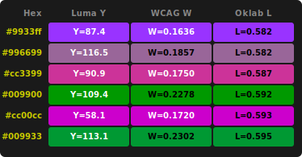

# Luma: Apple & Perceived Brightness

Apple uses [luma](#Luma) (perceived brightness) to set text color based on background color. Apple divides the full luma range into equal halves, providing a simple and consistent decision boundary.

When Safari uses a webpage <nobr><code>background-color</code></nobr> to color browser UI, it also calculates the <nobr><code>background-color</code></nobr> luma to set browser UI text color:

- **luma ≤ 127.5**: \
background is considered **dark** → Safari uses **light text**
- **luma > 127.5**: \
background is considered **light** → Safari uses **dark text**

This midpoint threshold better ensures legibility by selecting text colors that provide strong contrast against the background.

## Luma

Rec. 709 ([ITU Recommendation BT.709][ITU]) is the international standard for <abbr title="high-definition television">HDTV</abbr>. The luma calculation from this standard provides a way to convert RGB color values into a perceived brightness value that closely matches human visual perception.

Human eyes are more sensitive to green light than red and to red light than blue. Rec. 709 luma coefficients account for this by weighting each color channel differently. The weighted sum produces a single brightness value that represents how bright a color appears to the human eye.

### Luma Formula

```
Y = ( 0.2126 × R ) + ( 0.7152 × G ) + ( 0.0722 × B )
````

&nbsp;   | variable | range | weight
---------|----------|-------|-------
Red      | `R`      | 0-255 | 21.26%
Green    | `G`      | 0-255 | 71.52%
Blue     | `B`      | 0-255 |  7.22%
**Luma** | **`Y`**  | 0-255 |


### Examples

| HTML Color | HEX Color | `R` | `G` | `B` | `Y` | Text Color
|-------|-----|---|---|---|----------|-------|
| Black | `#000000` | 0 | 0 | 0 | 0.00 | light |
| Blue | `#0000FF` | 0 | 0 | 255 | 18.41 | light |
| Red | `#FF0000` | 255 | 0 | 0 | 54.21 | light |
| Gray | `#808080` | 128 | 128 | 128 | 128.00 | dark |
| Green | `#00FF00` | 0 | 255 | 0 | 182.38 | dark |
| Yellow | `#FFFF00` | 255 | 255 | 0 | 236.59 | dark |
| White | `#FFFFFF` | 255 | 255 | 255 | 255.00 | dark |

### Implementation Example

```javascript
function selectThemeWithLuma(bgColor) {
  // remove leading #
  let hex = bgColor.replace(/^#/, '');

  // parse RGB components from hex
  const r = parseInt(hex.substring(0, 2), 16);
  const g = parseInt(hex.substring(2, 4), 16);
  const b = parseInt(hex.substring(4, 6), 16);

  // calculate Rec. 709 Luma using standard coefficients
  const Y = 0.2126 * r + 0.7152 * g + 0.0722 * b;

  // threshold at midpoint: 127.5
  // Y ≤ 127.5 = dark background, use light text
  // Y > 127.5 = light background, use dark text
  return Y <= 127.5;
}
```

## Alternatives

### WCAG Relative Luminance
[Relative luminance][WCAG] in <abbr title="World Wide Web Consortium">W3C</abbr> Accessibility Guidelines uses the same Rec. 709 coefficients (0.2126, 0.7152, 0.0722) but applies a complex (slow) gamma correction formula to linearize sRGB values before weighting. This produces a 0-1 luminance value used to calculate accessibility contrast ratios. (Rec. 709 Luma skips this gamma correction step, applying coefficients directly to sRGB values.)

### Oklab Lightness

[Oklab] is a perceptual color model by Björn Ottosson. Its Lightness value `L` represents perceived brightness through a matrix transform and multi-step conversion: sRGB → Linear RGB → LMS cone response → cube root → Oklab. Equal steps in Oklab `L` correspond to equal perceived brightness differences (unlike with luma `Y`).

### Comparison

| Feature | ITU Rec. 709 <br> Luma | WCAG <br> Relative Luminance | Oklab <br> Lightness |
|---------|---------------|-------------------------|-----------------|
| Gamma Correction | No | Yes: complex formula | Yes: complex matrix transformation |
| Output Range | 0-255 | 0-1 | 0-1 |
| Threshold | 127.5 | 0.179 | 0.5 |
| Use Case | Perceived Brightness | Accessibility Contrast Ratios | Perceptual Color Manipulation |

### [Luma vs. WGAG vs. Oklab][vs.]



source: [Luma vs. WGAG vs. Oklab][vs.]

## References

- [ITU-R Recommendation BT.709][ITU]
- [W3C Accessibility Guidelines: relative luminance][WCAG]
- [Wikipedia: Luma][wiki]
- [Apple Developer: System-Defined Color Spaces][Apple]
- [Björn Ottosson: A perceptual color space for image processing (Oklab)][Oklab]


[ITU]: https://www.itu.int/rec/R-REC-BT.709/
[WCAG]: https://www.w3.org/WAI/GL/wiki/Relative_luminance
[wiki]: https://en.wikipedia.org/wiki/Luma_(video)
[Apple]: https://developer.apple.com/documentation/coregraphics/cgcolorspace/itur_709
[Oklab]: https://bottosson.github.io/posts/oklab/
[vs.]: https://safari-color-tinting.pages.dev/luma-vs-wcag-vs-oklch.htmlus